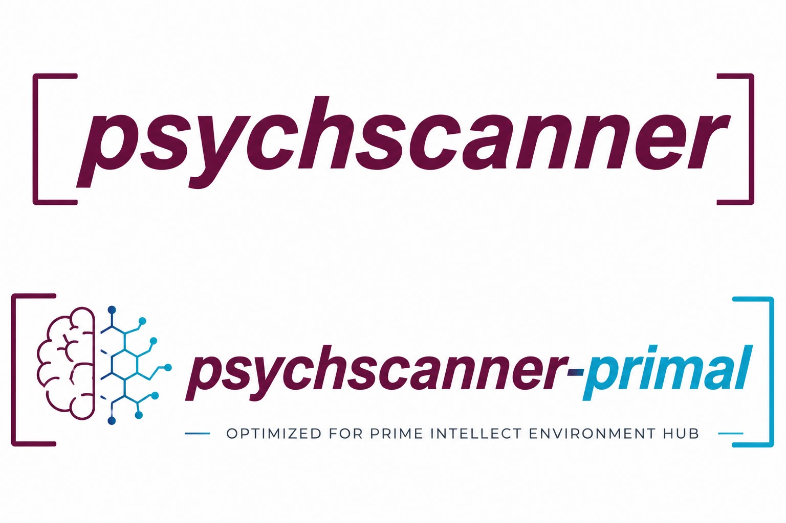
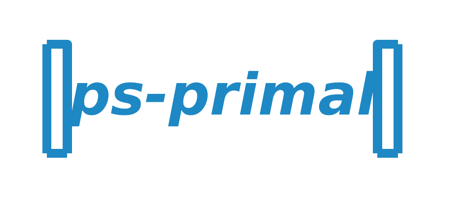

# psychscanner-primal



[](https://saurabhr.github.io/psychscanner-primal/)
[](https://github.com/saurabhr/psychscanner-primal/pulls)
[](https://github.com/saurabhr/psychscanner-primal/graphs/contributors)

Slim, Hub-optimized distribution of [psychscanner](https://github.com/saurabhr/psychscanner) — a framework for running psychological experiments with large language models.

This package exists as a lightweight dependency for RL/eval tooling such as the [Prime Intellect Environments Hub](https://docs.primeintellect.ai/tutorials-environments/environments): it carries only the tasks that have a real per-trial correct/incorrect signal, so they can be scored as a reward, plus the runtime needed to execute them. It does **not** itself register anything with Prime Intellect or depend on `verifiers` — it's the stable, minimal thing a Hub environment package would import.

> For the full research package — psychometric surveys (BFI-44, VVIQ-16), the LangGraph agent architectures, multimodal/interpretability backends (nnsight, nnterp, VLM), notebooks, and full docs — see [psychscanner](https://github.com/saurabhr/psychscanner).

<p>
  <a href="https://github.com/saurabhr/psyscan-library"></a>
  &nbsp;Vetted task cards for this package live in the <code>tasks/primal/</code> subfolder of <a href="https://github.com/saurabhr/psyscan-library"><code>psyscan-library</code></a>.
</p>
<p>
  Published Docker image: <a href="https://github.com/saurabhr/psychscanner-primal/pkgs/container/psychscanner-primal"></a>
</p>

## What's different from psychscanner

**Included:**
- Core runtime: `ExpCard`/`ExpCardInit`, `ScannerModel`, `TaskRunner`, `FeedbackBase`, `NextTrialBase`, parsers, `task_library`, `download_lib`, `SessionTunnel`, `SimulationModel`.
- Multi-provider model calling via LangChain (OpenAI, Anthropic, Groq, Mistral, Google, Ollama, HuggingFace, etc.) — same as upstream.
- Only the feedback-scored task cards: Reality Monitoring (`rm_*`) and paired-associate learning (`pal50`) — see [`examples/tasks/`](examples/tasks/).
- `CustomAgent`/`ScanningAgent` adapter protocol, for plugging in your own agent.

**Excluded:**
- Psychometric surveys (`bfi44`, `vviq16`, `example_survey`) — no ground truth to score against, so no reward signal; not meaningful as an RL/eval environment.
- The five LangGraph agent architectures (`agents.make_react_agent`, `make_planner_executor_agent`, `make_basic_reflection_agent`, `make_reflexion_agent`, `make_lats_agent`).
- Interpretability/multimodal backends: `nnsight_backend`, `nnterp_backend`, `vlm_backend`.
- Docs site sources, notebooks.

## Installation

```bash
uv venv psyscan-primal --python 3.11
source psyscan-primal/bin/activate

git clone https://github.com/saurabhr/psychscanner-primal.git
cd psychscanner-primal
uv pip install -e .
```

## Quick Start

Runs against the built-in `mock-llm` family (no API key, no network) so it works out of the box:

```python
from pathlib import Path
from psychscanner import ExpCardInit, ExpCard, ScannerModel, task_library, to_csv

task_path = task_library("rm_singleturn_demo", format="path", dirs="examples/tasks")

card = ExpCardInit(
    model       = "mock-llm",
    family      = "mock-llm",
    projectname = "primal_quickstart",
    proj_dir    = Path.cwd() / "results",
    cogtype     = "no",
    nsim        = 1,
    memory      = "SingleTurn",
    task_file   = task_path,
)

scanner = ScannerModel(expcard=ExpCard(card))
results = scanner.run()
df = to_csv(scanner, path=card.proj_dir)
```

Swap `model`/`family` for a real provider (see table below) to run against an actual LLM.

The install also adds a `psychscanner-primal` console command covering the same options (`psychscanner-primal --help`) — see the [CLI reference](https://saurabhr.github.io/psychscanner-primal/cli_reference/) for the full flag list.

## Supported Providers

Only `ollama` ships out of the box (`langchain-ollama` is a base dependency). Every other family needs its own LangChain integration package too, e.g. `uv pip install langchain-openai` for `openai` — see [LangChain's provider list](https://docs.langchain.com/oss/python/integrations/providers).

| Family | Env var |
|---|---|
| `openai` | `OPENAI_API_KEY` |
| `anthropic` | `ANTHROPIC_API_KEY` |
| `groq` | `GROQ_API_KEY` |
| `mistral` | `MISTRAL_API_KEY` |
| `google` / `gemini` | `GOOGLE_API_KEY` |
| `huggingface` | `HUGGINGFACEHUB_API_TOKEN` |
| `ollama` | — (local) / `OLLAMA_API_KEY` (remote) |

## Citation

If you use this package, please cite the psychscanner framework paper (and the Reality Monitoring paper, since that task is bundled here):

```bibtex
@unpublished{ranjan2026psychscanner,
  author = {Ranjan, Saurabh and Sokratous, Konstantina and Makwana, Mukesh},
  title  = {Psych Scanner: A Framework for Systematic Cognitive Evaluation of Large Language Models},
  note   = {Manuscript submitted for publication},
  year   = {2026},
}
```

Full reference list: [`CITATION.cff`](CITATION.cff), or the [upstream docs](https://psychscanner.readthedocs.io/en/stable/#citation).

## License

MIT — see [LICENSE](LICENSE).
